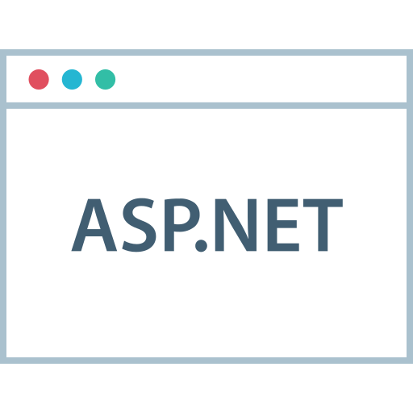

<h2 align="center">
    I'm
    
    DURJOY ACHARYA
     
</h2>


<p align="left">
  <samp>
    <br><br>
    Full stack developer
    <br><br>
     & Learner...
    <br><br>
    Focusing on building beautiful
    <br><br> 
    & Native applications...
  </samp>
</p>

<hr/>

<p align="left" >
<h3 align="left">FAVOURITE LANGUAGES</h3>
  
 
 
  <br />
  <br />
  
</p>
<br/>
<br/>
<p  align="right" >
  
  <br/>
  <br/>
  <h3 align="right">FAVOURITE FRAMEWORKS</h3>
  
  
  
  <br />
  <br />
  
  <br />
  <br />
</p>

<hr/>

<p align="center">
  
  Me as a code... 
  
</p>

```javascript
import { Durjoy } from "Artisan";

const languages = ["Java", "Typescript", "Javascript", "C#", "Java", "C++"];
const frameworks = ["SpringBoot", "Angular", "React", ".NET", "GO"];
const databases = ["PostgreSQL", "MSSQL", "Oracle"];

Durjoy.skills.push(...languages, ...frameworks, ...databases);
```

<hr/>

<p align="center">
  <!-- 
   -->
</p>

<br/>

<hr/>

<h2 align="center">Find me on</h2>

<p align="center">

  <a href="https://www.linkedin.com/in/durjoy-acharya/">
    
  &nbsp&nbsp&nbsp&nbsp
  <a href="https://leetcode.com/u/Rupkotha/">
    
  </a>
  &nbsp&nbsp&nbsp&nbsp
  <a href="https://github.com/CodeArtisanDurjoy/">
    
  </a>
  &nbsp&nbsp&nbsp&nbsp
  <a href="mailto:da-durjoy@outlook.com">
    
</a>
  &nbsp&nbsp&nbsp&nbsp
  <a href="https://durjoy-acharya.medium.com">
    
  </a>

</p>

<hr/>

<p align="center">
  
</p>

<p align="center">
  Made with ❤️ in Bangladesh
</p>

-----
<p align="center">
  <a href="https://www.buymeacoffee.com/dadurjoyr"></a>
</p>

